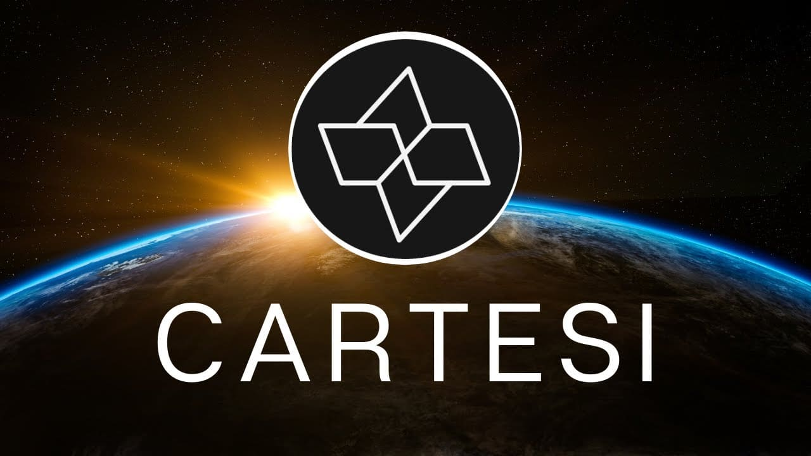

# Project Proposal
# DeFi Money Transfer DApp with Cartesi SDK

## Introduction

The decentralized finance (DeFi) space has witnessed remarkable growth, offering innovative solutions to traditional financial services. However, one persistent challenge in global transactions is the requirement for Know Your Customer (KYC) compliance, which poses barriers to entry for many individuals. Our proposed project aims to address this challenge by developing a DeFi application that enables frictionless money transfers across the world without the need for KYC verification. Leveraging the Cartesi SDK, we seek to optimize transaction costs and facilitate currency conversion, making financial inclusion a reality for all.

## Objectives

- Develop a decentralized application (DApp) for transferring money globally without KYC requirements.
- Utilize the Cartesi SDK to enhance the scalability, security, and cost-efficiency of transactions.
- Implement a user-friendly interface for seamless interaction with the DApp.
- Integrate mechanisms for token conversion to local currencies to facilitate usability.
- Ensure compliance with relevant regulations and standards, prioritizing user privacy and security.

## Technical Approach

- Smart Contract Development: We will design and deploy smart contracts on a blockchain network compatible with the Cartesi SDK. These contracts will manage the exchange of tokens securely and transparently, ensuring trustless transactions.

- Off-chain Computation: Leveraging Cartesi's off-chain computation capabilities, we will optimize complex tasks such as transaction validation and currency conversion off-chain. This approach reduces gas fees and enhances scalability without compromising security.

- User Interface Development: A user-friendly interface will be developed to allow users to initiate and track transactions effortlessly. This interface will provide clear instructions for interacting with the DApp and facilitate seamless token conversion.

- Integration with External APIs: Integration with external APIs for currency exchange rates and blockchain data will enable real-time updates and accurate conversion of tokens to local currencies.

## Expected Outcomes

- Frictionless Money Transfers: The developed DApp will empower users to transfer money globally without the burden of KYC verification, fostering financial inclusion and accessibility.

- Cost Efficiency: By leveraging off-chain computation and Cartesi's technology, we anticipate significant reductions in transaction fees compared to traditional DeFi platforms.

- Enhanced Usability: Intuitive user interface design and seamless token conversion will contribute to a user-friendly experience, attracting a broader user base.

- Compliance and Security: We will prioritize compliance with regulatory requirements and implement robust security measures to safeguard user data and assets.

## Project Timeline

- Weeks 1-2: Smart contract development and initial testing.
  
- Weeks 3-4: Integration of Cartesi SDK and off-chain computation logic.
  
- Weeks 5-6: User interface design and front-end development.
  
- Weeks 7-8: Integration with external APIs for currency conversion.
  
- Weeks 9-10: Comprehensive testing and debugging.
  
- Week 11: Deployment on testnet for community feedback and further testing.
  
- Week 12: Final optimizations and deployment on mainnet.

## Budget Allocation:

- Development Costs: X USD
- Integration Costs: 
- Testing and Quality Assurance: 
- Community Engagement and Marketing:
- Contingency:

## Team

Our team comprises experienced blockchain developers, smart contract engineers, UI/UX designers, and project managers with a proven track record in DeFi development and innovation.

## Conclusion

Our proposed DeFi Money Transfer DApp powered by the Cartesi SDK represents a groundbreaking solution to the challenges of global money transfers. By eliminating KYC requirements and optimizing transaction costs, we aim to democratize access to financial services and promote financial inclusion on a global scale. We are committed to delivering a robust and user-centric solution that adheres to the highest standards of security and compliance.
